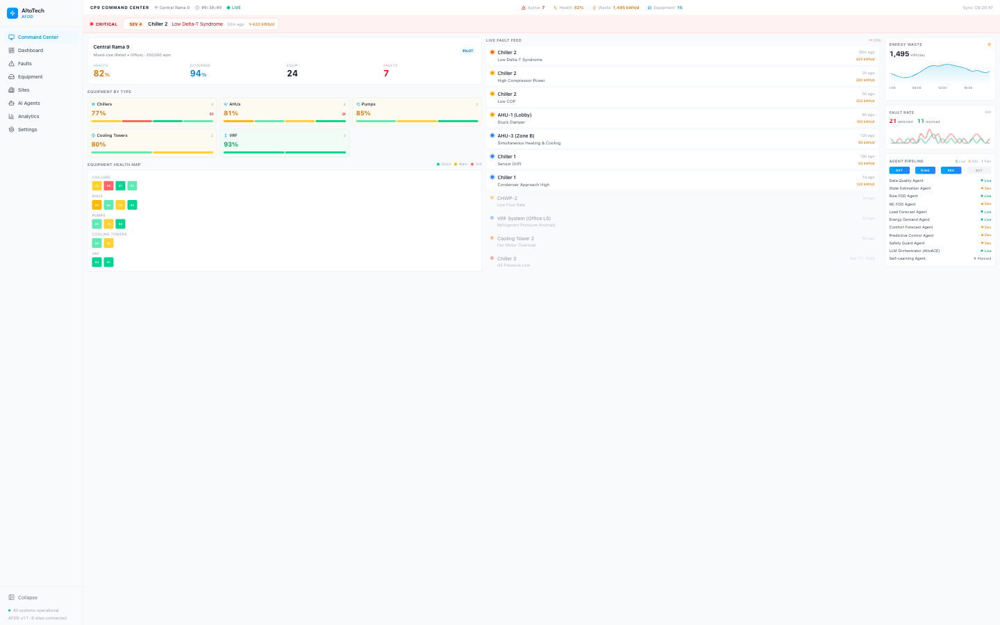
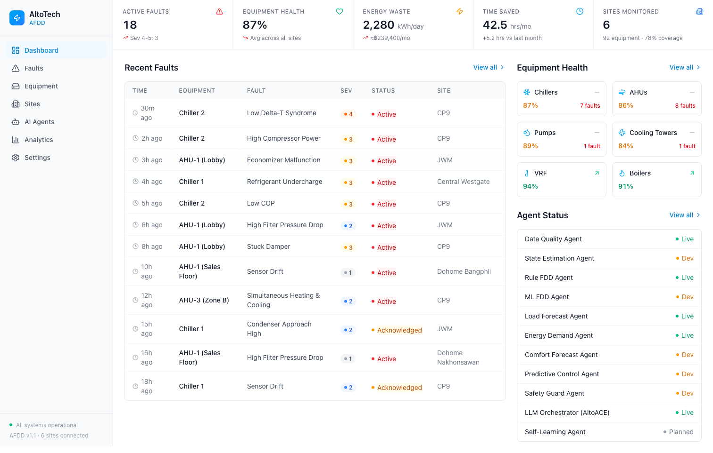
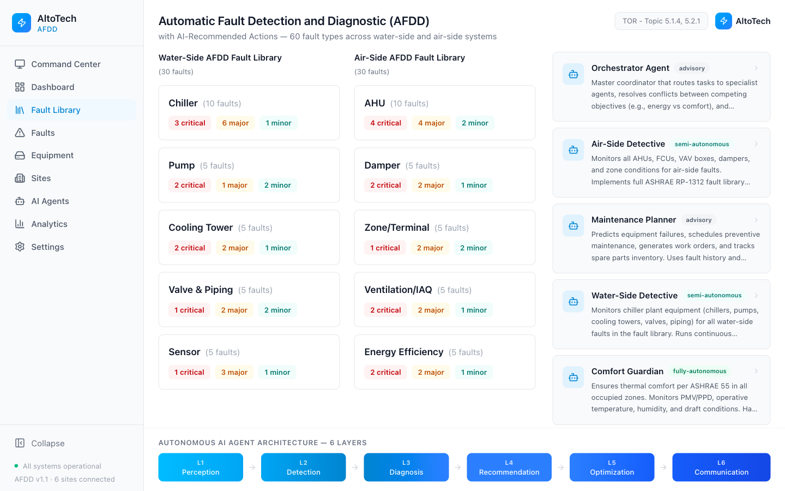
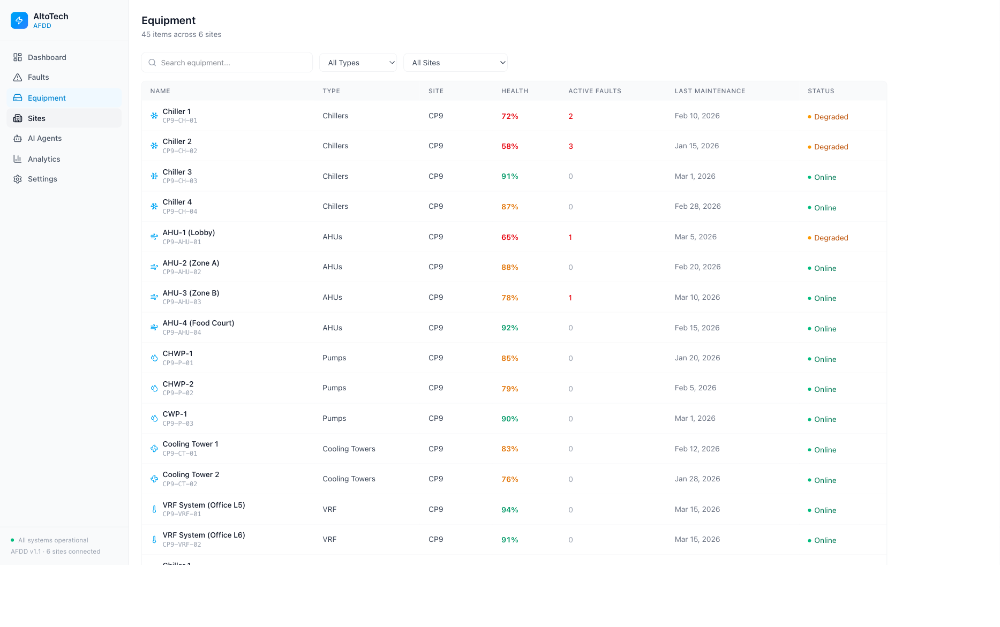
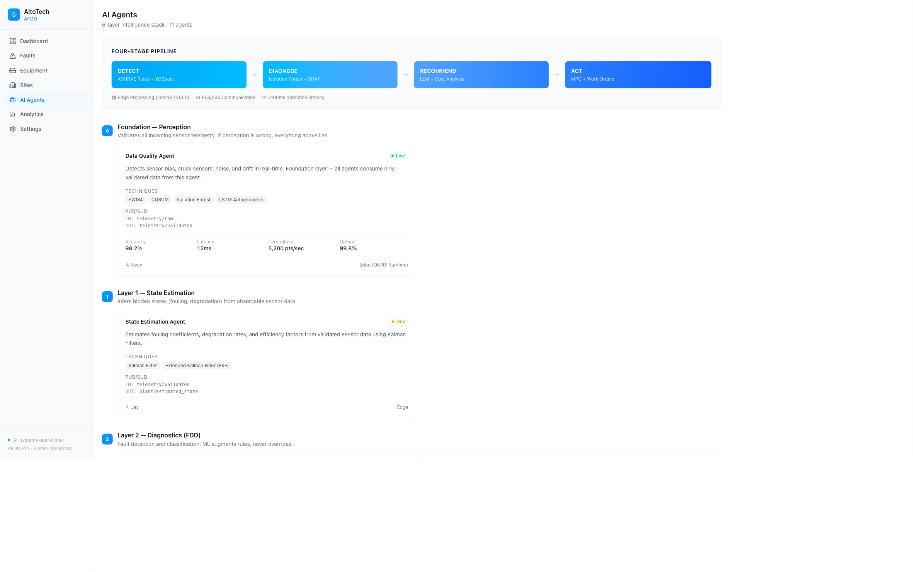
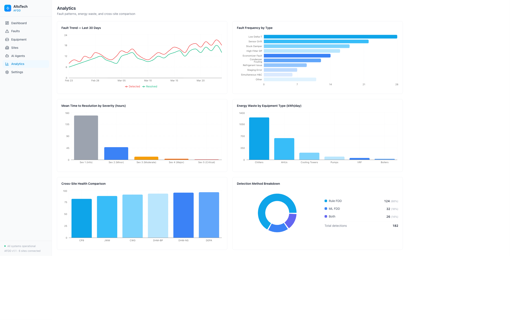

# AltoTech AFDD Dashboard

Automated Fault Detection, Diagnostics & AI Recommendation dashboard for commercial HVAC systems. Frontend-only with mock data — built for CPN executive demos and internal review.

**Stack:** React 19 + Vite 7 + Tailwind CSS v4 + Recharts + Lucide Icons

## Screenshots

### Command Center (CP9)
Operator's always-on monitoring view. Viewport-locked, CP9-focused. Shows critical alerts, site health, equipment by type, live fault feed with cost-of-inaction (฿), daily punch list sorted by savings, energy waste charts, and agent pipeline status.



### Dashboard
Management overview with KPI bar, recent fault feed, equipment health grid by type, and AI agent status panel.



### Fault Library
Product capability showcase — 60 fault types (30 water-side + 30 air-side) with expandable drill-down, 7 AI agents with autonomy levels, and 6-layer architecture pipeline. For TOR presentations.



### Equipment
45 equipment items across 6 sites with health scores, filterable by type and site. Click for detail modal with 30-day health trend, active faults, maintenance history.



### AI Agents
11 agents across 6 intelligence layers with DETECT → DIAGNOSE → RECOMMEND → ACT pipeline, performance metrics, pub/sub topics, and deployment info.



### Analytics
Fault trends, frequency by type, MTTR by severity, energy waste by equipment, cross-site health comparison, and detection method breakdown (Rule/ML/Both).



## Pages

| Page | Route | Purpose |
|------|-------|---------|
| Command Center | `/command-center` | NOC-style operator monitoring (CP9) |
| Dashboard | `/` | Management overview with KPIs |
| Fault Library | `/fault-library` | Product capability showcase (60 faults, 7 agents) |
| Faults | `/faults` | Filterable fault table + AI diagnosis modal |
| Equipment | `/equipment` | Equipment inventory + health detail |
| Sites | `/sites` | 6-property grid with drill-down |
| AI Agents | `/agents` | 11 agents across 6-layer stack |
| Analytics | `/analytics` | Charts and cross-site comparison |
| Settings | `/settings` | Thresholds, agent config, notifications |

## Features

- **AltoACE AI Chat** — Global slide-out panel with mock LLM responses (Claude Sonnet 4.6)
- **Cost of Inaction (฿)** — Every fault shows avoidable cost in Thai Baht
- **Daily Punch List** — Top 5 actions sorted by financial impact
- **Collapsible Sidebar** — Icon-only mode for maximum screen space
- **Fault Drill-Down** — Click any fault category to see ASHRAE codes and names

## Quick Start

```bash
cd alto-afdd
npm install
npm run dev
```

Open http://localhost:5173

## Build

```bash
npm run build   # Output in dist/
```

## Context

AltoTech Global — climate-tech company (smart buildings, IoT). 108 active properties, 5.9M sqm, 369.4K IoT points. AFDD is the key product differentiator for the Series A round with CPN (Central Pattana).

Target: 40+ hrs/month saved per site. Equipment: Chillers, AHUs, Pumps, Cooling Towers, VRF, Boilers.
